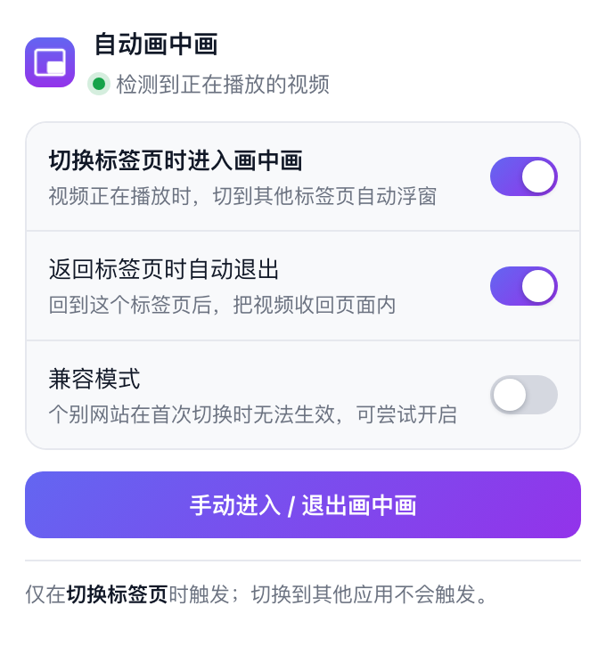
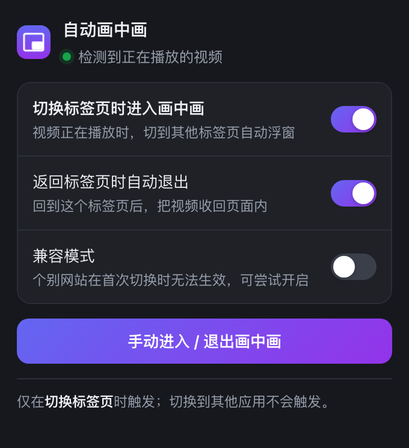

# 自动画中画 · Auto PiP on Tab Switch

一个 Chrome 扩展（Manifest V3）：**视频播放中切换标签页时尝试打开画中画，返回时可自动退出。连续自动进入仍受浏览器限制。**

## 它做了什么

| 你的操作 | 视频正在播放 | 视频已暂停 | 说明 |
| --- | --- | --- | --- |
| 切到**其他标签页** | ✅ 自动进入画中画 | ⬜ 不处理 | 核心行为 |
| 切回原标签页 | ⬜（可选择自动退出画中画） | ⬜ | 见「返回标签页时自动退出」 |
| 切到**其他应用**（⌘Tab / Alt+Tab） | ⬜ 不处理 | ⬜ 不处理 | 明确不触发 |
| 最小化浏览器窗口 | ⬜ 不处理 | ⬜ 不处理 | 不属于切标签页 |

「切标签页」和「切应用」的区分不是靠窗口焦点，而是靠**当前标签页是否还是所在窗口的活跃标签页**——切应用时活跃标签页不会变化，所以天然不会误触发。

## 安装

1. 打开 `chrome://extensions/`
2. 打开右上角的 **开发者模式**
3. 点 **加载已解压的扩展程序**，选择本目录（含 `manifest.json` 的那一层）
4. 建议把图标固定到工具栏，方便随时开关

> 使用支持 Manifest V3 和视频画中画 API 的桌面 Chrome。
> 每次重新进入都可能需要新的页面交互，当前版本不保证连续自动浮窗。
> 实际浮窗行为请在正常浏览器窗口中验证；单元测试只模拟浏览器事件与权限。

## 控制面板

点击工具栏图标打开，两个开关都保存在 `chrome.storage.sync`（会跟随账号同步）：

| 开关 | 默认 | 作用 |
| --- | --- | --- |
| **切换标签页时进入画中画** | 开 | 总开关。关掉后完全不再自动浮窗 |
| **返回标签页时自动退出** | 开 | 回到该标签页时把视频收回页面内 |

面板顶部还会显示当前标签页的状态（正在播放 / 已在画中画中 / 未检测到视频），底部按钮可手动进入或退出画中画。

历史界面预览（浅色 / 深色跟随系统；新版已用权限提示替换兼容模式）：

| 浅色 | 深色 |
| --- | --- |
|  |  |

## 工作原理与当前限制

当前版本已撤回 Media Session 的 `enterpictureinpicture` 回调接管，不覆盖或清空网站的媒体控制，也不改变视频右键菜单的行为。切走时仍通过 `visibilitychange → 后台确认切标签页 → requestPictureInPicture()` 尝试进入，返回时按开关退出。

**已知未解决：首次进入后，返回再切走可能无法再次自动浮窗。** 普通 PiP API 消耗短暂用户激活，不能通过点击一次或「进入再退出」预热永久解锁。当前优先恢复基本播放和手动退出，不宣称连续自动进入已修复。

快速返回或主动退出会取消尚未完成的进入请求。用户关闭浮窗后，本轮隐藏期间禁止自动重开；退出失败时面板显示错误名称。

### 从有问题的版本恢复

1. 在 `chrome://extensions/` 重新加载本扩展。
2. **刷新所有曾打开视频的标签页**，清除旧版已经注入的媒体会话回调。只重新加载扩展不会移除旧页面的回调。
3. 确认视频画面回到页面，再使用网站自身的画中画按钮测试进入和退出。
4. 如果刷新后仍卡在黑屏/画中画占位状态，关闭该视频标签页并重新打开。新页面恢复前不要重复触发画中画。

## 其他限制

**2. 跨域 iframe 里的播放器**
如果播放器在 iframe 里且 iframe 没有授权 `allow="picture-in-picture"`，浏览器会直接禁止画中画——这属于页面自身的权限策略，扩展无法绕过。

**3. DRM 视频**
Netflix 等受 DRM 保护的内容可能拒绝进入画中画。

**4. 切换到另一个 Chrome 窗口**
本扩展把「切标签页」定义为**同一个窗口内换了活跃标签页**。若你把视频窗口完整地留在屏幕上、只是切到另一个 Chrome 窗口，不会触发。

## 文件结构

```
├── manifest.json         # MV3 清单：只申请 storage 权限 + 全站内容脚本
├── background.js         # Service Worker：判定「切标签页」还是「切应用」
├── content.js            # 内容脚本：找播放中的视频、进出画中画
├── popup.html/css/js     # 控制面板
├── icons/                # 16 / 32 / 48 / 128 图标
├── docs/                 # 控制面板预览图
├── package.json          # 构建脚本入口
├── build/                # 打包产物（已写入 .gitignore）
└── tools/
    ├── gen-icons.mjs     # 生成 icons/ 下的 PNG
    ├── package.mjs       # 打包成 zip
    └── lib/zip.mjs       # 手写 ZIP 写入器（仅用 node:zlib）
```

## 构建与打包

不需要 `npm install`——脚本只用 Node 标准库，克隆下来就能跑：

```bash
npm test          # 事件、短暂激活和异步竞争回归测试
npm run icons     # 重新生成 icons/ 下的四个 PNG
npm run package   # 打包成 build/auto-pip-on-tab-switch-<version>.zip
npm run build     # 上面两步一起跑
```

打包走白名单（`tools/package.mjs` 里的 `INCLUDE`），只收进扩展运行时需要的文件，
README、docs、tools 都不会进包，产物可直接上传 Chrome 应用商店或解压分发。
若 `manifest.json` 引用了白名单里缺失的文件，打包会**报错退出**而不是产出一个坏包。
打包产物目录 `build/` 已写入 `.gitignore`。

排查问题时，可先在 `chrome://extensions/` 点扩展卡片上的刷新按钮，再重新加载出问题的页面。

## 恢复验证

- 视频能正常显示在页面中。
- 网站画中画按钮能进入，退出后画面回到页面。
- 插件能退出当前页面的视频画中画；失败时显示实际错误。
- 关闭浮窗后不会由插件立即重新打开。
- 切标签页后的自动进入只作为尝试，第二次因激活不足失败仍是已知限制。

单元测试只验证脚本状态控制，不能证明系统浮窗可见，也不能替代真实浏览器验收。
